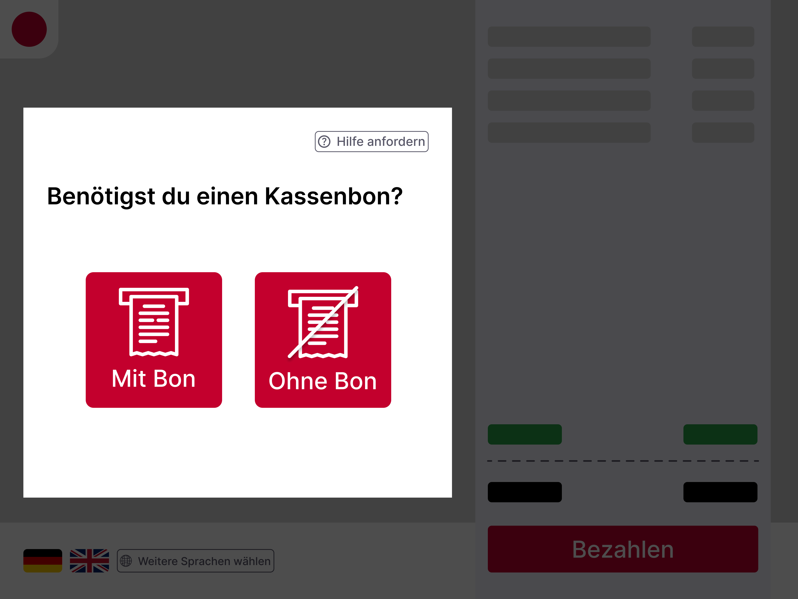
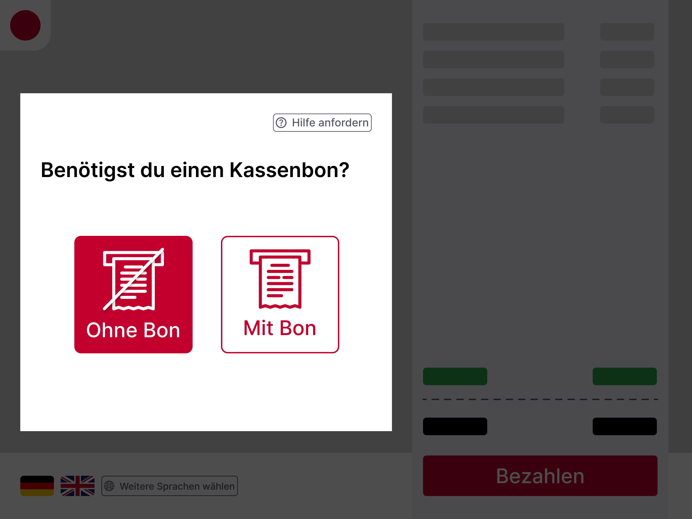
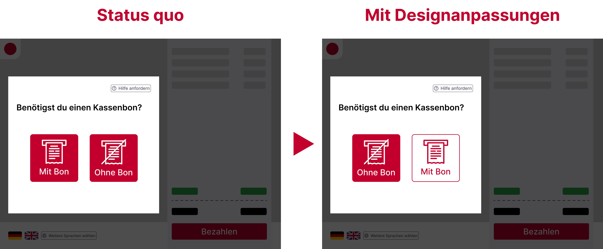

Gestern Nachmittag konnte ich eine interessante Beobachtung machen. Meine Freundin und ich waren in meiner Heimat einkaufen, unter anderem auch im Drogeriemarkt **Rossmann**. Nachdem wir einige Produkte ausgewählt hatten, entschieden wir uns für den Self-Checkout, um schneller durch die Kasse zu kommen. Dabei fiel mir etwas auf, das mich zum Nachdenken brachte...

Nachdem wir unsere Einkäufe bezahlt hatten, stellte uns das Self-Checkout-System eine einfache Frage: *Benötigst du einen Kassenbon?* Mein erster, fast reflexartiger Gedanke war: *“Komme ich ohne Kassenbon überhaupt aus dem Laden?”* Schließlich gibt es in manchen Supermärkten Systeme, bei denen der Kassenbon als Beleg dafür dient, dass die Waren bezahlt wurden – ohne diesen Beleg kann man den Laden nicht verlassen. Bei Rossmann jedoch gibt es kein solches System. Der Kassenbon wird also nicht unbedingt benötigt.

## Die Details im Self-Checkout – Gleichwertige Buttons

Nachdem klar war, dass der Kassenbon für den Ausgang keine Rolle spielt, schaute ich mir die Gestaltung des Self-Checkouts genauer an. Da ist mir aufgefallen, dass **Rossmann bei den Buttons für die Kassenbon Ausgabe eine identische visuelle Hierarchie verwendet**. Beide Buttons – *Mit Bon* und *Ohne Bon* – sind gleich groß, haben dieselbe Farbe und denselben Schriftstil. Als Kunde habe ich dadurch die freie Wahl, ob ich einen Bon ausgedruckt haben möchte oder nicht, ohne dass eine Option besonders hervorgehoben wird.

#### Abbildung 1: Status-quo des User Interface der Kassenbon Ausgabe

## Das Potenzial von Nudging – Kleine Änderungen, große Wirkung?

Das brachte mich auf den Gedanken, wie diese kleine Entscheidung genutzt werden könnte, um das Verhalten der Kunden in eine positive und vielleicht auch nachhaltigere Richtung zu lenken. An dieser Stelle kommt das Konzept des **Nudging** ins Spiel. Das 2008 von Thaler und Sunstein beschriebene Prinzip des Nudging bezieht sich auf kleine Eingriffe in die Entscheidungsarchitektur, die unser Verhalten in eine gewünschte Richtung lenken, ohne unsere Entscheidungsfreiheit einzuschränken. Ein klassisches Beispiel dafür ist die Platzierung von gesunden Lebensmitteln auf Augenhöhe im Supermarkt, um uns zu einer gesünderen Wahl zu animieren.

Digital Nudging überträgt dieses Prinzip in den digitalen Raum. Dabei werden gezielte Design- und Interaktionselemente eingesetzt, um das Verhalten der Nutzer in digitalen Umgebungen zu steuern – sei es auf Webseiten, in Apps oder eben bei Self-Checkout-Systemen. Weinmann et al. (2016) definierten **Digital Nudging** als den gezielten Einsatz von Designelementen, die das Verhalten der Nutzenden in eine gewünschte Richtung lenken, ohne ihre Entscheidungsfreiheit zu beschränken.

## Framing und visuelle Aufmerksamkeit – Wie die Darstellung unser Verhalten beeinflusst

Beim Framing geht es grundlegend darum, wie die Darstellungen von Informationen unser Verhalten beeinflusst. Es handelt sich um gezielte Änderungen in der Darstellung, die unsere Wahrnehmung steuern und somit auch die Bedeutung bestimmter Informationen für uns verändern (Tversky & Kahneman, 1974). Diese kleinen Anpassungen (z. B. farbliche Hervorhebungen) können einen großen Einfluss auf unsere Entscheidungen haben – oft ohne, dass wir es bewusst merken. 

Ein weiterer Aspekt ist, wie wir visuelle Reize richtig setzen. In westlichen Kulturen, in denen von links nach rechts gelesen wird, nehmen wir typischerweise zuerst die linke Seite eines Bildschirm wahr. Dies beeinflusst, wo  unser Blick zuerst hinfällt und welche Informationen wir als wichtiger empfinden. Durch gezielte visuelle Anpassungen im Layout - wie die Platzierung und Hervorhebung von Optionen - kann subtil gesteuert werden, welche Entscheidungen uns leichter fallen. 

## Wie könnte Framing im Self-Checkout bei Rossmann aussehen?

**Jetzt stellt sich natürlich die Frage, ob die genannten Prinzipien auch beim Self-Checkout von Rossmann anwendbar sind?** Ich denke, ja! Ich werde im Folgenden zwei Designanpassungen vorstellen, die darauf abzielen, die vorgestellten Effekte zu nutzen: 

1. Die erste Designpassungen wäre es, die beiden Buttons im Self-Checkout unterschiedlichen zu gestalten. Dies wäre ein klassisches Beispiel für **Framing** im digitalen Raum. Zum Beispiel könnte der Button *Kein Bon* auffälliger gestaltet sein. Das würde dazu führen, dass mehr Kunden unbewusst eher diese Option wählen.
2. Die zweite Designanpassung betrifft die Platzierung der Buttons. Der Button *Kein Bon* könnte links auf dem Bildschirm platziert werden, sodass die Kunden diese Option als erste wahrnehmen. 

#### Abbildung 2: Designanpassungen des User Interface der Kassenbon Ausgabe

Durch diese einfachen Designänderungen könnte beispielsweise Rossmann nachhaltiger agieren, indem Kunden subtil dazu gebracht werden, weniger Kassenbons auszudrucken – und somit Papier zu sparen. Das Beispiel zeigt, wie Digital Nudging das Verhalten in digitalen Entscheidungsumgebungen positiv beeinflussen können, ohne die Entscheidungsfreiheit der Kunden einzuschränken.

## Fazit

Am Ende meines Einkaufs wurde mir bewusst, wie spannend es ist, dass schon kleine Änderungen in der Gestaltung von digitalen Systemen potenziell unsere Entscheidungen beeinflussen könnten. Gerade beim Self-Checkout könnte durch eine einfache Anpassung – sei es in der Größe, Farbe oder Platzierung der Buttons – das Verhalten der Kunden subtil, aber möglicherweise effektiv in eine nachhaltigere Richtung gelenkt werden.

Im Fall von Rossmann ließe sich Nudging theoretisch einsetzen, um Kunden dazu zu bringen, umweltfreundlichere Entscheidungen zu treffen, wie etwa auf den Ausdruck eines Kassenbons zu verzichten. Diese kleinen Veränderungen könnten zwar minimal erscheinen, könnten aber in ihrer Gesamtheit einen positiven Effekt haben, indem sie dazu beitragen, den Papierverbrauch zu reduzieren und somit nachhaltigere Praktiken zu fördern.

#### Abbildung 3: Vergleichsgrafik: Eine Vorher-Nachher-Darstellung zeigt links die gleichwertigen Buttons des aktuellen Designs und rechts die angepassten Buttons, bei denen der “Kein Bon”-Button hervorgehoben wurde.*

Zudem ist auch hier nochmal anzumerken, dass kein rechtlicher Check vorgenommen wurde. Es könnte durchaus sein, dass mögliche entscheidungsunterstützende Maßnahmen in dieser Branche rechtlich nicht zulässig sind oder bestimmten Vorschriften unterliegen. Daher müsste vor der Umsetzung solcher Konzepte eine entsprechende rechtliche Prüfung erfolgen.

Dennoch bin ich bin sehr gespannt, welche weiteren Entwicklungen uns in dieser Richtung begegnen werden und ob Unternehmen in Zukunft stärker auf solche Designanpassungen setzen werden, um nicht nur das Kundenerlebnis zu verbessern, sondern auch ihren ökologischen Fußabdruck zu verkleinern.

# Referenzen

Thaler, R. H., & Sunstein, C. R. (2008). Nudge: Improving Decisions About Health, Wealth, and Happiness. Yale University Press.

Weinmann, M., Schneider, C., & Brocke, J. V. (2016). Digital Nudging. Business & Information Systems Engineering, 58(6), 433–436. https://doi.org/10.1007/s12599-016-0453-1

Tversky, A., & Kahneman, D. (1974). Judgment under Uncertainty: Heuristics and Biases: Biases in judgments reveal some heuristics of thinking under uncertainty. Science, 185(4157), 1124–1131. https://doi.org/10.1126/science.185.4157.1124
